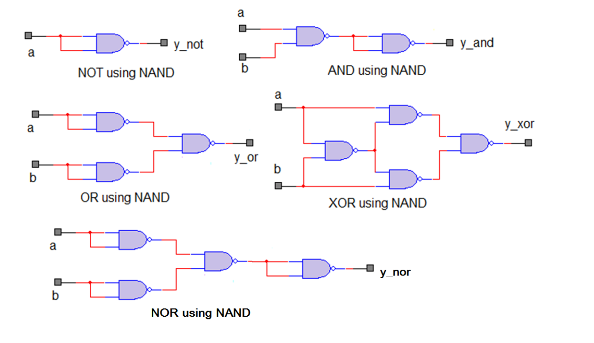
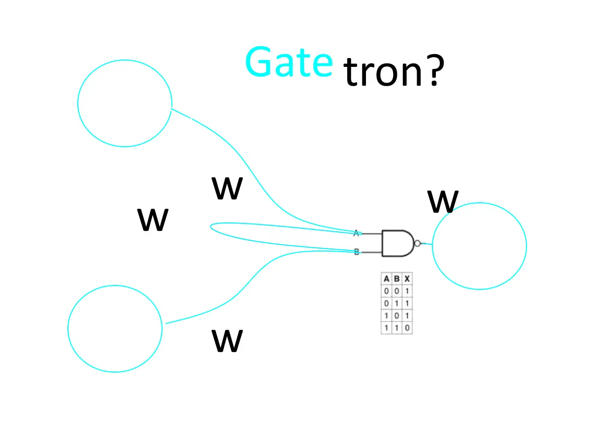

This basic idea spawned in my head when relatively recently when I watched a recent discovery by blue brain folks. that some real biological dendrites fire to axons only when two simultaneous inputs to them fired at the same time. 

I.e they kinda worked like logical AND gate. 
Not only there was correlation detection built in single connection.

But, what is even more important time played role as oposed to our current ml architectures. 

Our biggest and best/Gpt3 with 175b params still has no idea what it did 3s ago and has no context.

I.e what if dendrites do logic like " if this leading edge of a and b and 10s later x mul y is bigger than threshold c than not o" ?

Perhaps in each connection is droping potential that acts as a timer/delay?

And in one neuron and one axon/neuron has a houndreds of them in 

In reality, one neuron can be a pretty dense state machine? That would also explain how bio can do so much complex logic with so few neurons/layers. So I started this repo hoping to create simple nn but with logic gates behind weights. 

Could this be all they need without the need for any sort of gradient descent and backprop? 

Can they "learn new things" just by selecting or pruning gates? 

How?

Well, basic observation from those observing biological neurons essentially was one sentence.

"if it fires together then it wires together"

Also, a recent observation from a human brain project was that neurons grow and connect pretty much in random directions and connections form just by bumping into each other.

Perhaps we should grow random connections from time to time and prune those where we are not detecting firing together.

That we  have high order hierarchical correlation detection, infinite scalability since you keep growing but also pruning locally irrelevant signals

Plus I wanna test this as spiking networks too. 

Why?

I feel frequencies and especially phase/timing play important role in nn inputs. 

I.e hard truth is that in the end 

Recently nerf needed to reintroduce sinuses to input to be able to learn and converge. 

Transformers needed to introduce sinuses back to input as positional encoding also. 

But sadly. Even our best like gpt3 has no idea about time and context, 

I.e what it produced 3s ago. Perhaps transformers need time introduced in positional encoding where month year day sec will all just be sin frequencies encoding when input happened? In biological neurons, we actually observed exactly that. 

So why not work with frequencies and time as first-class citizens in the first place? after all, evolution is not dumb if from all possible, just binary spiking networks survived then there must be an energy efficiency reason for it. with frequencies, you get all the weird and wonderful world of standing reflected absorbed negated waves.

And gradients and waves are a basic building block in 3d biological topology probably for energy conserving? reason too? I.e that's how any living 3d organ is shaped from the lowest molecule = 3d gradients and waves. 

As for which gates to use.
It turns out you need just one. 

NAND 

And can pretty much create all 7 possible known logical circuits from it just by a wiring bunch of nands in a specific way

Therefore basic building block of our new hopefully spiking (but compared to biological ones not limited to just 5khz) network would be this.
Let's call it GateTron

there is weight also between two inputs in order to work as negation by shortcircuiting two nand inputs. 
But this seems stupid perhaps having and or not everywhere is better energy-wise better than this stupid additional switch weight?

Hmm Also...
When you think about it. looking at a typical biological neuron with all those hundreds of complex dendritic connections all not meeting at one point but via some kind of complex hierarchical,  more and more sparse structure.

Structure, in fact not that much different from half of the autoencoder.
Isn't the dendritic half of a neuron actually half of a typical hourglass autoencoder architecture?

Isn't there dimensionality reduction happening in similar higher order feature detection way too?
Arn't those higher order corelation detection and connections ner top of axon thus actually outputs?

Or are the acually inputs but from other higher order detected features from different neuron?
I.e are connections near axon top leading to connections near axon top on other neuron? Or is it random, but when they are then they are in fact acting like autoencoders where say 10 axons were middle of autoencoder?

Isn't therefore each neuron an autoencoder?
